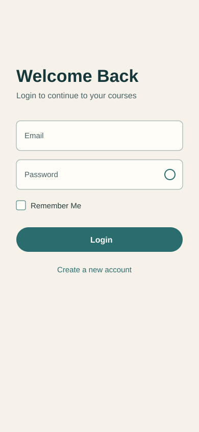
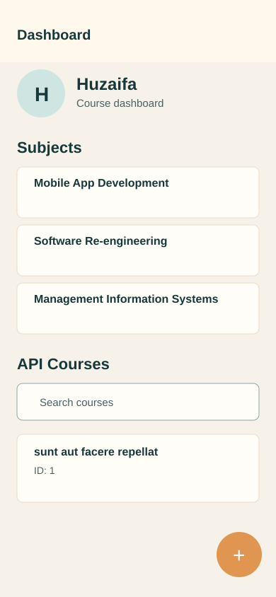

# Flutter Application Development - CRUD API Integration

Student Name: Muhammad Salman  
Student ID: SE-221020  

Repository: `huzaifa12-dot/MobAppDevAssignment`  
Branch: `feature/course-api-integration`

## Overview

This branch contains Assignment 2, extending the authentication application with REST API based CRUD operations for course data.

## API Used

- API: JSONPlaceholder
- Endpoint: `https://jsonplaceholder.typicode.com/posts`
- Documentation followed: `https://jsonplaceholder.typicode.com/guide`

## Features

- Fetch courses with GET and display ID, title, and description.
- Loading indicator while fetching.
- Error and empty states.
- Add course with POST.
- Edit course with pre-filled form and PUT.
- Delete course with DELETE and confirmation dialog.
- Separate API service layer and Provider controller.

## Screenshots





## Run Project

```bash
flutter pub get
flutter run
```
