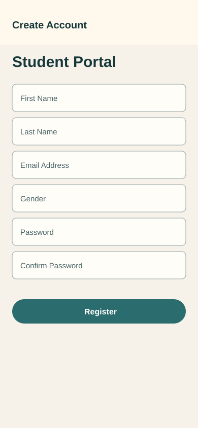

# Flutter Multi-Screen Application Development

Student Name: Huzaifa  
Student ID: SE-221020  

Repository: `huzaifa12-dot/MobileAppDev_Assignments`  
Final branch: `feature/offline-cache-and-state-manangement`

## Overview

This Flutter project combines the three Mobile App Development assignments:

- Assignment 1: Multi-screen authentication app with registration, login, dashboard, detail screen, validation, enums, and controller/service separation.
- Assignment 2: JSONPlaceholder CRUD API integration using GET, POST, PUT, and DELETE.
- Assignment 3: Offline cache, Provider state management, repository pattern, optimistic updates, pull-to-refresh, search, loading, empty, and error states.

## API Used

The application uses JSONPlaceholder:

- API: `https://jsonplaceholder.typicode.com/posts`
- Documentation followed: `https://jsonplaceholder.typicode.com/guide`

Course records are mapped from JSONPlaceholder posts, where `title` is used as the course title and `body` is used as the course description.

## Tools and Packages

- Flutter
- Provider for state management
- HTTP for REST API calls
- SharedPreferences for authentication session and local course cache
- Connectivity Plus for online/offline checks
- Flutter Lints for code quality

## Architecture

The course feature follows this structure:

`UI -> Provider Controller -> Repository -> API Service -> Local Storage`

- UI screens only render data and collect user input.
- Controllers manage loading, success, error, and empty states.
- The repository decides when to use the remote API and when to load local cached data.
- The API service only handles HTTP requests.
- Local storage stores fetched course data for offline usage.

## Offline and State Management Approach

After a successful API fetch, courses are saved locally with SharedPreferences. When the device is offline, the repository returns cached courses so the app remains usable. Provider is used to separate UI from business logic and to manage course state consistently.

Update and delete actions use optimistic UI updates. The UI changes immediately, then rolls back to the previous list if the API request fails.

## Branches

- `main`: Assignment 1 multi-screen authentication app.
- `feature/course-api-integration`: Assignment 2 CRUD API integration.
- `feature/offline-cache-and-state-manangement`: Assignment 3 offline support and Provider/repository upgrade.

## Screenshots

Screenshots are included in the `screenshots` folder.





## Run Project

```bash
flutter pub get
flutter run
```
